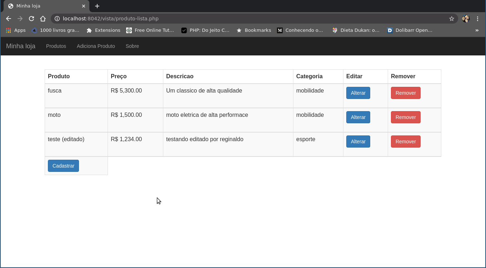

## Controle de estoque em PHP

Um sistema simples em PHP para estudo da linguagem. 

#### Dependencia
```
	docker
```
#### Instalação 
```

docker build -t m-controle-estoque .

# Rodando o projeto 
docker run -d -p 80:8042 m-controle-estoque

# Rodando o projeto em desenvolvimento
docker run -it -p 80:8042 -v $(pwd):/controle-estoque  m-controle-estoque

```



&copy; 2021  regiefe@gmail.com
